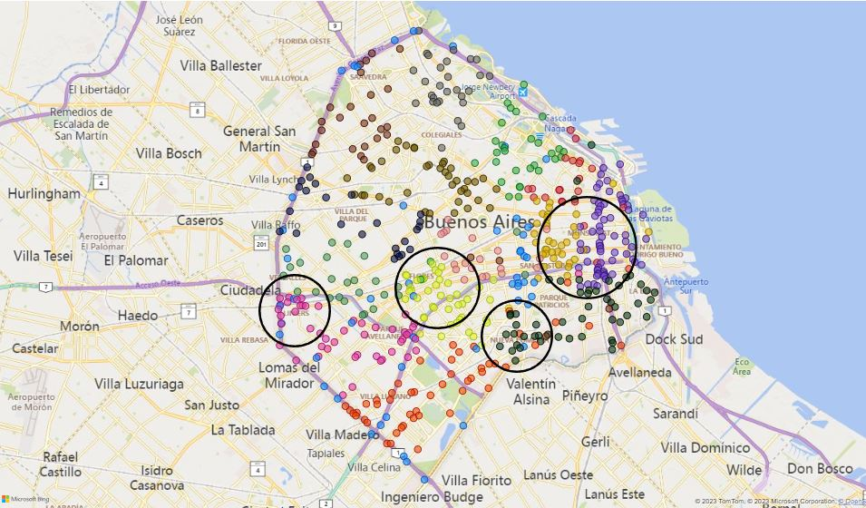

<h1 align='center'>
 <b>PROYECTO INDIVIDUAL Nº2</b>
</h1>
 
# <h1 align="center">**`Siniestros viales`**</h1>

## **Descripción del problema**

Los siniestros viales, también conocidos como accidentes de tráfico o accidentes de tránsito, son eventos que involucran vehículos en las vías públicas y que pueden tener diversas causas, como colisiones entre automóviles, motocicletas, bicicletas o peatones, atropellos, choques con objetos fijos o caídas de vehículos. Estos incidentes pueden tener consecuencias que van desde daños materiales hasta lesiones graves o fatales para los involucrados.

En el contexto de una ciudad como Buenos Aires, los siniestros viales pueden ser una preocupación importante debido al alto volumen de tráfico y la densidad poblacional. Estos incidentes pueden tener un impacto significativo en la seguridad de los residentes y visitantes de la ciudad, así como en la infraestructura vial y los servicios de emergencia.

Las tasas de mortalidad relacionadas con siniestros viales suelen ser un indicador crítico de la seguridad vial en una región. Estas tasas se calculan, generalmente, como el número de muertes por cada cierto número de habitantes o por cada cierta cantidad de vehículos registrados. Reducir estas tasas es un objetivo clave para mejorar la seguridad vial y proteger la vida de las personas en la ciudad.

Es importante destacar que la prevención de siniestros viales involucra medidas como la educación vial, el cumplimiento de las normas de tráfico, la infraestructura segura de carreteras y calles, así como la promoción de vehículos más seguros. El seguimiento de las estadísticas y la implementación de políticas efectivas son esenciales para abordar este problema de manera adecuada.

### **Contexto**

En Argentina, cada año mueren cerca de 4.000 personas en siniestros viales. Aunque muchas jurisdicciones han logrado disminuir la cantidad de accidentes de tránsito, esta sigue siendo la principal causa de muertes violentas en el país.
Los informes del Sistema Nacional de Información Criminal (SNIC), del Ministerio de Seguridad de la Nación, revelan que entre 2018 y 2022 se registraron 19.630 muertes en siniestros viales en todo el país. Estas cifras equivalen a 11 personas por día que resultaron víctimas fatales por accidentes de tránsito.

Solo en 2022, se contabilizaron 3.828 muertes fatales en este tipo de hechos. Los expertos en la materia indican que en Argentina es dos o tres veces más alta la probabilidad de que una persona muera en un siniestro vial que en un hecho de inseguridad delictiva.

### **Rol a desarrollar**

El `Observatorio de Movilidad y Seguridad Vial` (OMSV), centro de estudios que se encuentra bajo la órbita de la ***Secretaría de Transporte*** del Gobierno de la Ciudad Autónoma de Buenos Aires, CABA, me ha solicitado la elaboración de un proyecto de análisis de datos, con el fin de generar información que le permita a las autoridades locales tomar medidas para disminuir la cantidad de víctimas fatales de los siniestros viales.
Para ello, disponibiliza un dataset sobre homicidios en siniestros viales acaecidos en la Ciudad de Buenos Aires durante el periodo 2016-2021. Este dataset se encuentra en formato *xlsx* y contiene dos hojas llamadas: **hechos** y **víctimas**. Asimismo, incluye otras dos hojas adicionales de diccionarios de datos, que sirve de guía para un mayor entendimiento de la data compartida.

## **Propuesta de trabajo**

Acorde al requerimiento recibido, los productos a entregar son los siguientes:

- 'ETL' (Extract, Transfrom and Load) de la data recibida para llegar a una base de datos limpia y completa que permita realizar todo el análisis requerido.

- `EDA` (Exploratory Data Analysis) de la data, con el propósito de caracterizar a la población víctima y permita identificar patrones de conducta o de espacio/tiempo o de uso del servicio de transporte que, a su vez, sean herramientas importantes para la autoridad competente y puedan definir políticas y/o acciones que logren reducir año a año los accidentes de tránsito y, por ende, las muertes en ellos.

- `Dashboard` interactivo que permita explorar detalladamente los datos, que sea de fácil interpretación tanto su lectura como los análisis extraídos de los mismos y oriente a los interesados en las acciones a implementar para redudcr los casos en estudio.

- `KPIs`, a saber:

    - *Reducir en un 10% la tasa de homicidios en siniestros viales de los últimos seis meses, en CABA, en comparación con la tasa de homicidios en siniestros viales del semestre anterior*
 
    - *Reducir en un 7% la cantidad de accidentes mortales de motociclistas en el último año, en CABA, respecto al año anterior*

- `Repositorio de GitHub`, por último, se entrega todo en un repositorio de github, debidamente documentado.

## Fuente de datos
- [Buenos Aires Data](https://data.buenosaires.gob.ar/dataset/victimas-siniestros-viales): deberán utilizar el dataset denominado `Homicidios`

## **ETL**

Se recibe del OMSV una data en un archivo en excel de título: homicidios.xlsx, que contiene dos hojas con datos, una HECHOS con datos de los diversos accidentes de tránsito fatales registrados en CABA entre 2016 y 2021, con 697 registros, y VICtIMAS con el detalle de las víctimas en los mismos, 717 registros.

Lo primero que se hizo fue transformar las dos hojas de datos en dataframe de python: df_victimas y df_hechos. A ambas DF se les eliminaron duplicados y columnas innecesarias para el análisis. 

Al df_victimas se le realizóp un análisis descriptivo para detectar valores atípicos, encontrando que el campo edad tenía 53 registros sin dato de edad, por lo que se decidió eliminar dichos registros y posteriormente, se convirtió el campo en entero para poder procesarlo adecuadamente, se renombró el campo ID_hechos como ID para poder realizar el cruce con el df_hechos. Al df_hechos, además de lo nombrado ya, no se le realizaron más depuraciones o ajustes.

Con los 2 dataframe ajustados, se procedió a unirlos, creando el archivo victimas.xlsx, eliminando innecesarias, realizando búsqueda/eliminación de duplicados, ajuste de formatos de algunos campos y creación de tres variables nuevas: ciclo_vida (reagrupamiento de la variable edad, en los grupos: infantes (1 a 5 años), niños (6 a 11 años). adolescenten (12 a 17 años), jóvenes (18 a 28 años), adultos (29 a 59 años) y ancianos (mayores de 50 años)), horario (reagrupamiento de la variable HH en los grupos: mañana (6 a 12), tarde (12 a 18) y noche (18 a 6)) y semestre (reagrupamiento de la variable MM en los grupos: Primer semestre (1 a 6) y Segundo semestre (6 a 12)), necesarias para un mejor análisis de los datos. Esa base final para análsis, victimas.xlsx, quedo conformada por 663 registros correspondientes cada uno a una víctima mortal en accidentes de tránsito, ocurridos en CABA durante los años 2016 a 2021 .

## **EDA**

Explorando los datos minuciosamente, se encontraron los siguientes hallazgos:

La distribución de las víctimas mortales por año, muestra un descenso significativo en los últimos 3 años, del 35% entre el periodo 2019-2021 y el periodo 2016-2018, coioncidencialmente el periodo 2019-2021 fue el tiempo de la pandemia, por lo que esa disminución puede ser como consecuencia de las normas de comportamiento determinadas en su momento, que para el caso de estudio resultaron muy efectivas. A continuación se muestra la tabla y la gráfica resumen:

| Año | Muertes |
| ------ | ------ |
| 2016 | 130 |
| 2017 | 133 |
| 2018 | 141 |
| 2019 | 91 |
| 2020 | 75 |
| 2021 | 93 |
| Total | 663 |

TABLA 1. TOTAL VICTIMAS DE ACCIDENTE DE TRANSITO EN CABA, POR AÑO Y MEDIO DE TRANSPORTE

La tabla anterior muestra un fenómeno a tener presente, y es el alto volumen de muertes en accidentes de transito de quienes viajan en moto, año tras año, y aunque se ha presentado una disminución en los últimos 3 años, muy similar al decremento global, se puede seguir considerando a las motos como un vehículo de alto riesgo de muerte a la hora de un accidente de tránsito.

Continuando con el análisis, se puede ver que los meses de noviembre, diciembre y enero son los de mayor concentración de las muertes, coincidencialmente época de verano, vacaciones:

Y analizando por el vehículo donde se transportaba la víctima, el periodo entre noviembre y enero presenta la mayor cantidad de accidentes mortales en moto (ver tabla 2), 95 de 280, que representa el 34% de las muertes en moto. Esto debe es una alerta para las autoridades respectivas, para que ejerzan un mayor control a los motociclistas y que velen por tener en buen estado las vías más frecuentadas por ellos.

TABLA 2. TOTAL VICTIMAS DE ACCIDENTE DE TRANSITO EN CABA, ENTRE 2016-2021, DIFERENCIAS POR MES Y MEDIO DE TRANSPORTE

Construyendo un perfil para caracterizar a las diferentes víctimas, la siguiente tabla puede brindar información relevante:

TABLA 3. TOTAL VICTIMAS DE ACCIDENTE DE TRANSITO EN CABA, ENTRE 2016-2021, DIFERENCIAS POR SEXO, ROL Y MEDIO DE TRANSPORTE

- La mayoría de las víctimas son hombres (el 77%, 509 de 663 víctimas).
- El 42% (281 de 663) perdió la vida en un accidente involucrada una moto, de los cuales el 88% eran hombres (247 de 281) y casi la totalidad eran los conductores de la moto (231 de 247, motociclistas hombres).
- El 37% de las víctimas eran peatones (245 de 663), de los cuales el 61% eran hombres y el 39% mujeres.
- Al respecto, el ser peatones es el rol más importante entre las causas de muerte entre las mujeres, el 62% de las víctimas mujeres eran peatones (96 de 155), y el segundo, el ser pasajeras, el 20% (31 de 155), principalmente de motos.
- Entre los hombres, el rol que tenían la mayoría de las víctima al momento del accidente era de conductor, bien sea de moto, auto, carga, móvil, el 58% (293 de 509), seguido del hecho de ser peatón, el 30% (149 de 509).

A continuación ae presenta un análisis por algunas carecterísticas particulares, relevantes para detectar focos de acción:

**Componente georreferencial**

Georreferenciando los accidentes de tránsito mortales, se detectaronn 4 zonas de alta concentración de accidentes fatales, la más grande la zona e la que colindan las comunas 1 y 3, la zona occidental de la comuna 4, la parte centrel de la comuna 7 y la zona noroccidental de la comuna 9, otra alerta para las autoridades en su tarea de disminuir la accidentalidad vehicular así como la mortalidad derivada, sería recomendable visitar dichas áreas para verificar el estado de las vías, la calidad y oportunidad de las señales de tránsito, la semaforización, el estado de puentes vehocuilares y peatonales, entre otras:

Presentando el total de vícitmas por comuna en la que se presentó el siniestro, es evidente el alto volumen de casos en las comunas 1, 4 y 9, que albergan el 35% de los casos (232 de 663). Adicionalmente, las comunas 1, 4 y 9 tienen el 38% de las muertes de peatones (94 de 245), las comunas 1, 4, 9, 8 y 7, el 49% de las muertes en moto (137 de 280 )y la comuna 9, tiene el 22% de las muertes en auto (20 de 90)(ver tabla 4).

TABLA 4. TOTAL VICTIMAS DE ACCIDENTE DE TRANSITO EN CABA, ENTRE 2016-2021, DIFERENCIAS POR COMUNA Y ROL DE LA VICTIMA

Analizando los siniestros por el tipo de vía en la que se presentaron los casos, las avenidas registran la mayorías de los siniestros viales, pero no deja de llamar la atención el 9% de accidentes presentados en la Gral. Paz, una vía conocida por al alto tráfico vehicular, con tramos que pueden albergar hasta 300.000 vehículos por día y al repasar el mapa, se ve con claridad sectores de dicha vía con múltiples casos, como son los sectores General San Martín, Ciudadela y Viila Madero

TABLA 5. TOTAL VICTIMAS DE ACCIDENTE DE TRANSITO EN CABA, ENTRE 2016-2021, POR EL TIPO DE CALLE DEL SINIESTRO

**Ciclos de vida**

Del total de muertes, el 3% corresponde a infantes, niños y adolescentes, que aunque no es muy volumen alto, es para tener presente, pues esto puede llevar a cuestionar los sistemas de seguridad de los vehículos y motos, el respeto de las señales y normas de tránsito por parte de conductores y petaones, el estado de las vías, incluso si las velocidades máximas permitidas en ciertos tramos de las vías es el pertinente o no. Otras evidencias, es el alto porcentaje de víctimas en edad productiva (jóvenes y adultos, entre 18 y 28 años), el 75% de los casos (ver tabla 6).

TABLA 6. VICTIMAS DE ACCIDENTE DE TRANSITO EN CABA POR CICLO DE VIDA, ENTRE 2016-2021.

De la tabla anterior, se puede notar que del total de víctimas mujeres, el 80%, 124 de 155, eran adultas y ancianas (personas mayores de 29 años), mientras que el 62% de las víctimas hombres, eran jóvenes y adultos (entre 29 y 59 años), que viajaban en moto mayotitariamente. Adicionalmente, podemos observar que el mayor porcentaje de mujeres fallecidas en accidentes viales eran peatonas, mayores de 29 años (adultas y ancianas).

La tabla 7 muestra la distribución de las muertes por sexo, ciclo de vida y horario del accidente, es interesante ver que entre las mujeres no hay diferenciación entre horarios, lo que indica que una mujer puede morir en un accidente de tránsito en cualquier jornada del día, caso contrario los hombres, que del total de fallecidos el 50% muere en accidentes ocurridos en la noche, entre 6pm y 6am, y por ciclos de vida, los hombres adultos son los de mayor probabilidad de morir a cualquier hora.

TABLA 7. VICTIMAS DE ACCIDENTE DE TRANSITO EN CABA POR SEXO, CICLO DE VIDA Y HORARIO DEL ACCIDENTE, ENTRE 2016-2021.

Por comunas, la tabla 8 revela que el mayor volumen de muertes viales de adultos, se da en la comuna 1, que en los jóvenes en la comuna 4, y en los ancianos, en las comunas 1 y 9. 

TABLA 7. VICTIMAS DE ACCIDENTE DE TRANSITO EN CABA POR CICLO DE VIDA Y COMUNA EN LA QUE SE PRESENTÓ EL ACCIDENTE, ENTRE 2016-2021.

De lo anterior, se pueden sacar recomendaciones importantes:

- La población más vulnerable a morir en un accidente de tránsito son los hombres, no importanto el rol que desempeñen en el accidente, y con mayor probabilidad si conducen una moto, por lo que la tarea de las autoridades se debe intensificar en esa población, ejerciendo mayores controles a los motociclistas, con retenes de control, obligatoriedad de los sistemas de seguridad personal como el uso del casco, chalecos reflectivos, exigencia de una revisión tecnico-mecánico periódica a las motos, cursos de reforzamiento sobre las leyes de tránsito, tener en buen estado y bien señaladas las vías principales y alternas y con semáforos funcionando al 100% siempre.
- Entre las mujeres, preocupa la alta tasa de muertes como peatonas, por lo que se debe intensificar jornadas pedagógicas para mejorar el comportamiento de ellas y todos, como el respeto de los semáforos, cruzar las vías solo por las zonas delimitadas y los puentes peatonales, evitar camimar cerca a vías de alto tráfico en horas de la noche y si es necesario hacerlo, llevar elementos de serguridad como chalecos reflectivos y para los mayores de edad, ir acompañados.

